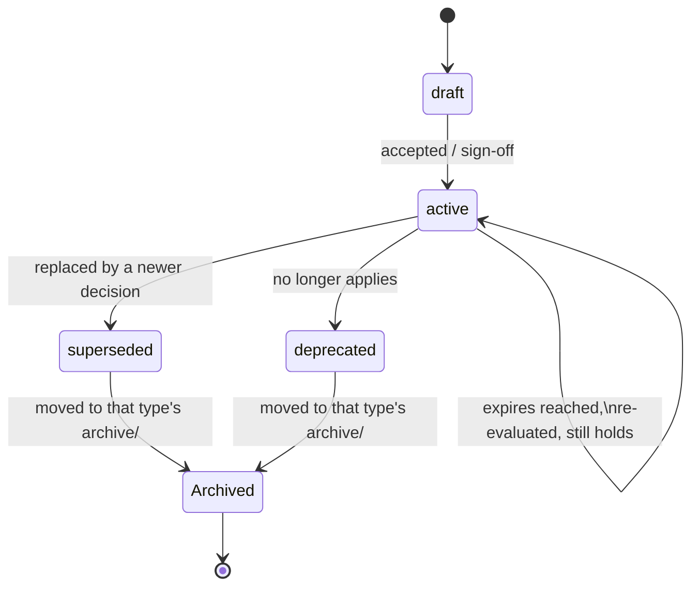
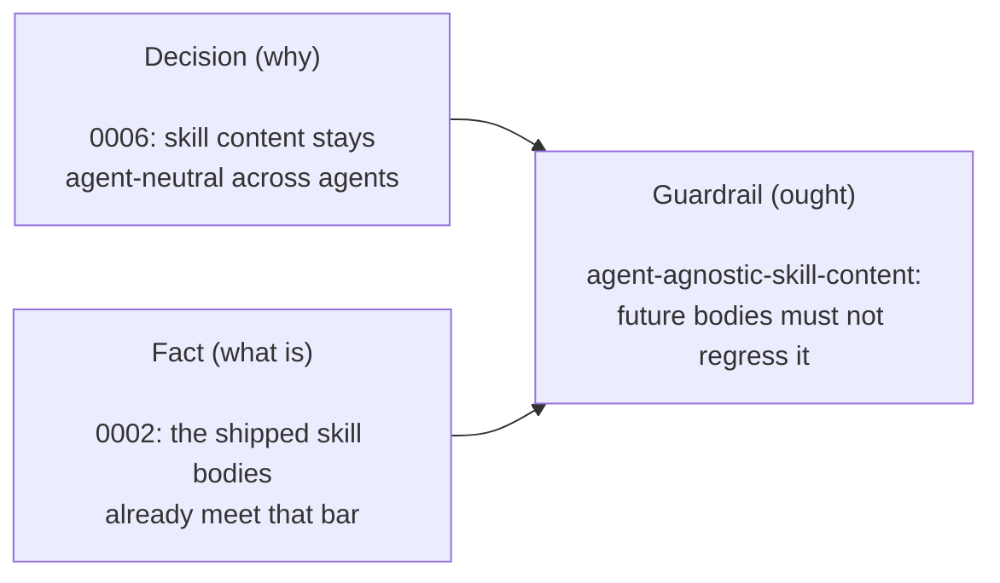
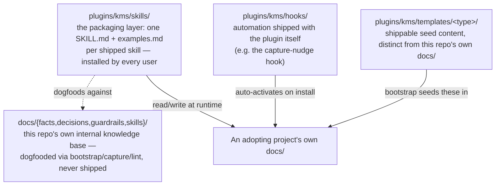
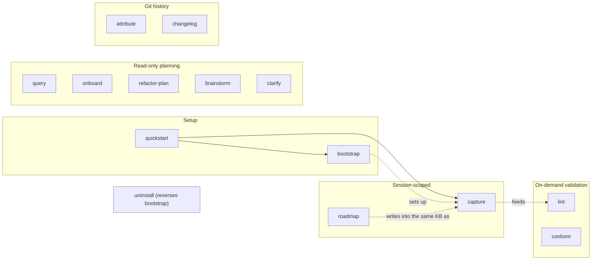

# Architecture

A deeper look at what `kms` is and how it's built — for a contributor
deciding whether to dig in, or anyone evaluating whether to adopt it.
For the terse, agent-facing version of this content (loaded at runtime
by the skills themselves), see `docs/skills/kms-architecture.md` and
`plugins/kms/shared/artifact-model.md`. This file is neither of those —
it's read once by a human, not loaded into an agent's context on every
invocation, so it takes the room those can't afford to.

## Overview

The problem `kms` addresses: an AI coding agent doesn't fail because it
runs out of memory — it fails because it has no vocabulary for
knowledge. A vector database retrieves a similar-looking snippet, but
it can't tell a settled decision from a stale guess, or a hard
constraint from a passing note. `kms` gives an agent that vocabulary:
four typed kinds of knowledge, each with its own fields, lifecycle, and
role, checkable by a shipped skill rather than trusted to a probability
score. [The full argument is here](https://medium.com/@strebulaev/taxonomy-is-a-language-why-your-ai-agent-needs-a-vocabulary-not-more-memory-000b8023a40a);
this file is about how `kms` actually implements it.

## The artifact model

Four governed types, each answering a different question:

| Type | Question it answers | Mode | Example |
|---|---|---|---|
| **Fact** | What's true right now? | descriptive | "The service runs on port 8080." |
| **Decision** | What did the team commit to, and why? | axiomatic | "We use Conventional Commits type prefixes." |
| **Guardrail** | What must or must not happen? | normative | "Never log PII." |
| **Procedure** | How do you decide or act? | procedural | "Steps for adding a new coding-agent target." |

Every artifact carries base frontmatter — `id`, `title`, `status`,
`date`, `tags` — plus type-specific fields (a fact's `kind` and
`governed-by`; a guardrail's `governed-by`, `grounded-in`, and
`derivation-note`; a decision's `track` and optional `accepted-by`; a
procedure's optional `operationalizes`).

A decision's `track` says which kind of claim it is: **product** — what
the project is for and who it serves — or **process** — how it's built,
organized, or shipped. Exactly one value, never both; a rollup spanning
several decisions is computed at read time, never stored as a third
value (`docs/decisions/0038-track-field-mutual-exclusivity.md`).

`status` moves through one shared lifecycle, with an optional `expires`
(a date or condition) triggering early re-evaluation instead of letting
a bounded decision stand as current past its own stated limit
(`docs/guardrails/decision-expires-must-be-reevaluated.md`):

A guardrail is never invented from nothing — it's *derived*:

If either source changes — the decision gets superseded, or the fact
stops being true — the guardrail is stale and `lint` flags it (check
13). This is the mechanism that keeps `kms`'s own knowledge base from
silently drifting out of sync with itself, and it's the same mechanism
any adopting project gets for free.

## Governance

"Governance" isn't one field — it's the composite of four things
`kms` already does, worth naming together rather than leaving scattered:

- **Traceability**: `governed-by`/`grounded-in` force every guardrail
  and fact to name what authorized it. Nothing is asserted without a
  citation back to its source.
- **Change control**: a decision is never edited in place once
  accepted — only superseded by a new one. Combined with each
  superseding decision's own `## Why` explaining what changed and why
  (`0048` superseding `0046`, `0049` superseding `0041`), this gives a
  real semantic audit trail — not just *what* text changed (git already
  gives that for free), but *why the meaning* changed, preserved
  permanently rather than squashed away.
- **Enforcement**: `lint` is passive governance — does everything still
  trace correctly, is anything stale or contradictory. `conform` is
  active governance — does an incoming change respect what's already
  been decided *before* it lands, not after. Neither runs on its own; a
  `SessionStart` hook nudges toward `lint` once enough recent commits
  have touched the knowledge base to make drift plausible (`0055`) —
  closing the gap between "this check exists" and "someone remembers to
  run it."
- **Accountability**: `accepted-by` (optional, on decisions) records
  who is accountable for a decision's content, independent of who ran
  the commit — a distinction that matters once an AI agent is doing the
  drafting and committing on a human's behalf (`0053`).

A few dimensions were deliberately left out, not overlooked — worth
saying so explicitly rather than leaving a future reader to wonder:

- **A `scope` field**: tried once (`0014`), dropped (`0039`) because
  nothing that existed ever used it. Not resurrected without a sharper
  definition than last time.
- **A composite "quality" score**: no such field exists. What it would
  mean is already decomposed into three separately-checked things —
  lifecycle `status` (draft = not yet trusted), structural completeness
  (`lint` flags undeclared/missing-field artifacts), and economy (`lint`
  check 10) — which is more actionable than one opaque number.
- **A `domain` field**, for a monorepo hosting several weakly-coupled
  products: deferred until `kms` actually operates at that scale, with
  the trigger condition for revisiting it logged in advance (`0054`),
  rather than built ahead of a demonstrated need.

## The four layers

`kms`'s own `docs/` is real, working knowledge about `kms` itself —
every decision cited in this file lives there, checkable the same way
any adopting project's knowledge base is checkable. That's not a demo;
it's the same system, turned on itself.

## How the skills fit together

`bootstrap` sets a project's knowledge base up once, or gap-fills an
incomplete one. `capture` turns a session's work into decisions and
facts as it happens. `lint` validates the whole knowledge base on
demand, independent of any one session, and owns every check that
isn't genuinely session-scoped. `conform` is the odd one out — the only
skill that reads code or content *outside* `docs/` and checks it
against the knowledge base, rather than validating the knowledge base
itself. `query`/`onboard` read and answer; `roadmap`/`refactor-plan`/`brainstorm`/`clarify`
plan without writing (except `roadmap`, which does); `attribute`/`changelog`
write git history; `uninstall` reverses everything `bootstrap` added.

## How the design got here

`kms` wasn't designed once — it was interviewed into its current shape
over dozens of decisions, several of which changed course after real
use exposed a gap. A few of the pivotal ones:

- [`0001`](docs/decisions/0001-knowledge-artifact-storage-convention.md) — the foundational storage convention: knowledge artifacts live under `docs/{facts,decisions,guardrails,skills}/`.
- [`0016`](docs/decisions/0016-lint-skill.md) — split whole-knowledge-base validation (`lint`, on demand) from session-scoped reasoning (`capture`), so neither has to do both jobs.
- [`0037`](docs/decisions/0037-plans-not-a-governed-artifact-type.md)–[`0039`](docs/decisions/0039-unify-lifecycle-and-drop-scope.md) — the taxonomy retrofit: plans excluded from the governed model, `track` made mutually exclusive, lifecycle `status` unified into one enum across all four types.
- [`0041`](docs/decisions/archive/0041-index-and-archive-for-scale.md)/[`0042`](docs/decisions/0042-tag-vocabulary-and-scoped-contradiction-check.md) — scale mechanisms for a knowledge base with real history: per-type indexes, an archive convention, a canonical tag vocabulary. (`0041` is itself now superseded by `0049` below — its archive mechanism stands, only the index's file format changed.)
- [`0043`](docs/decisions/0043-eval-harness-for-shipped-skill-changes.md)/[`0044`](docs/decisions/0044-eval-harness-ci-safety-gates.md) — a real eval harness (Kilo Code CLI + promptfoo) gating shipped skill-body changes, wired into CI.
- [`0047`](docs/decisions/0047-operationalizes-field-and-unoperationalized-guardrail-check.md) — closing a gap where a guardrail's required behavior could go unenforced with nothing to catch it.
- [`0049`](docs/decisions/0049-plain-csv-index-not-toon.md) — a self-correction: an earlier choice (naming the index format after an external spec) caused real, measured harm and was reverted to something simpler.
- [`0050`](docs/decisions/0050-version-bump-changelog-linkage.md)/[`0051`](docs/decisions/0051-grounded-in-may-hold-a-decision.md) — closing two more gaps a full self-audit found: version bumps shipping with no changelog entry, and guardrails structurally unable to record their real basis.
- [`0053`](docs/decisions/0053-decision-accepted-by-field.md)/[`0054`](docs/decisions/0054-defer-business-domain-dimension.md) — governance dimensions considered together: accountability made explicit (accepted-by), domain boundaries deliberately deferred until a real need exists, not built ahead of one.

Full history: `docs/decisions/` (plus `docs/decisions/archive/` for
superseded ones — every reference above still resolves regardless of
which side of that line it's on).

## Where to go next

- **Using `kms`**: [`README.md`](README.md), [`INSTALLING.md`](INSTALLING.md).
- **Contributing**: [`CONTRIBUTING.md`](CONTRIBUTING.md), `AGENTS.md`.
- **The agent-facing internals**: `docs/skills/kms-architecture.md`, `plugins/kms/shared/artifact-model.md`.
- **Why this design, in prose**: [the Medium article](https://medium.com/@strebulaev/taxonomy-is-a-language-why-your-ai-agent-needs-a-vocabulary-not-more-memory-000b8023a40a).
